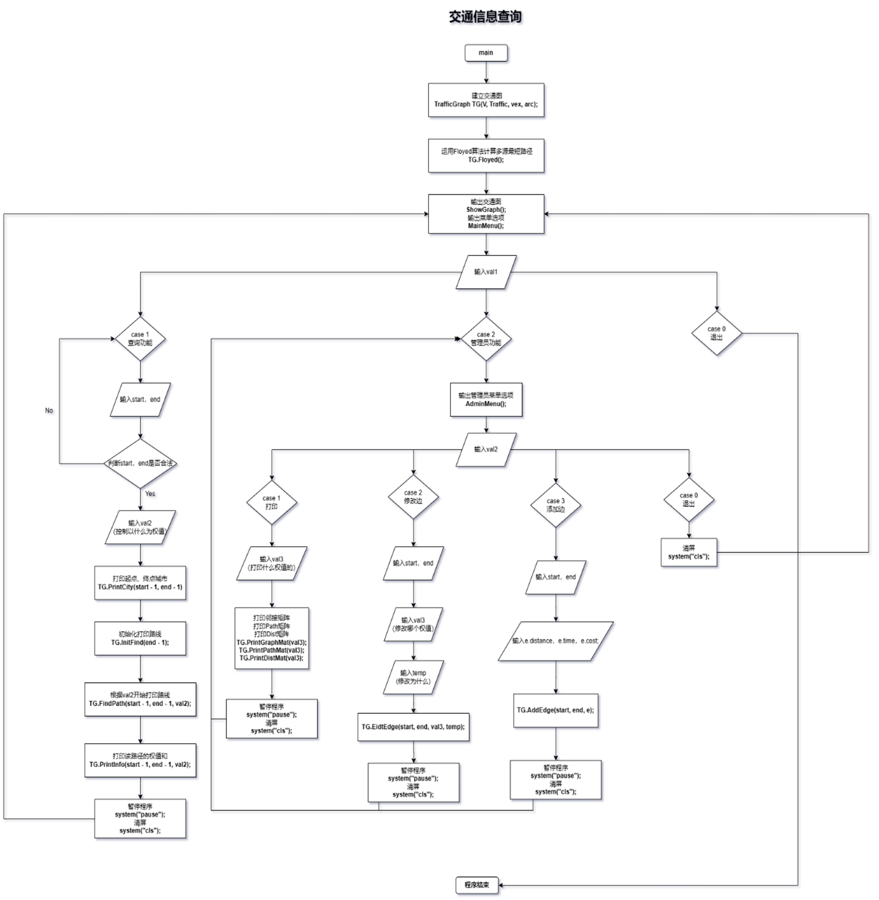

# 交通信息查询系统 - TrafficGraph

## 声明
**请勿抄袭！！！仅供参考！！！！课程作业请自己写！！！！！**

---

## 一、题目介绍

### 问题描述

随着铁路交通网络的日益发达，旅客在出行时不仅关注交通费用，还关注里程和时间。为此，设计一个交通查询系统，该系统应满足以下查询需求：
- 任意两个城市之间的最短里程
- 最低花费
- 最短时间
- 最少中转次数

### 基本要求

设计合理的数据结构和算法来编写程序，完成上述功能，并提供一个查询界面，能够通过下拉菜单进行选项查询。

---

## 二、解决思路和算法思想

为了满足旅客查询需求（最短里程、最低花费、最短时间、最少中转次数），由于每个城市之间的里程、时间和花费是线性的，这些问题可以归结为**最短路径问题**。

采用 **Floyd-Warshall 算法** 计算多源最短路径。虽然 Floyd-Warshall 算法的时间复杂度为 O(n³)，但相比于 Dijkstra 算法，它只需进行一次计算，就能获得所有点之间的最短路径，这对于查询系统而言更加高效。计算结果可存储在 `Dist[][]` 和 `Path[][]` 矩阵中。

为实现查询最优路径，可使用 `FindPath()` 递归打印路径，并通过 `Dist[][]` 矩阵获得最优路径的最小权值。

---

## 三、数据结构设计说明

### 数据结构分析

题目给出了一幅交通图，交通图可采用**邻接矩阵**或**邻接表**存储。为简化问题，本项目采用**邻接矩阵法**存储交通图。

- **图类 TrafficGraph**:
  - **顶点信息数组** `VertexType Vex[]`: 用于存储城市名称
  - **邻接矩阵** `EdgeType Edge[][]`: 用于存储边的信息
  - **顶点数量** `int VexNum`: 存储图中的顶点数
  - **边数量** `int ArcNum`: 存储图中的边数
  - **距离矩阵** `EdgeType Dist[][]`: 用于存储各顶点间的最短距离
  - **路径矩阵** `int Path[][]`: 用于存储最短路径信息

### 边的信息

题目中，图中的每条边包含以下信息：
- 距离 `distance`
- 耗时 `time`
- 花费 `cost`
- 边长 `len`（用于计算最少中转次数）

边的信息存储在结构体 `EdgeType` 中，包含距离、耗时、花费和边长。

为方便初始化邻接矩阵，设计了一个 `GraphInfo` 结构体，包含起点 `Vex1`、终点 `Vex2` 以及边权值 `EdgeType Weight`。通过该结构体，输入每条边的信息，最终构造图的邻接矩阵。

---

## 四、主程序的流程图和功能模块流程图

### 主程序流程图

### 功能模块图

---

## 五、运行结果

以下为程序运行的示例输出：

